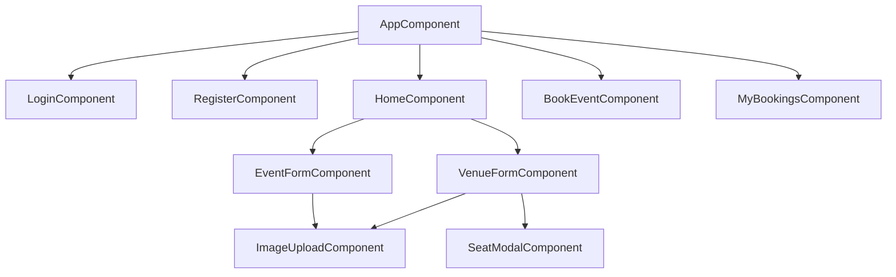
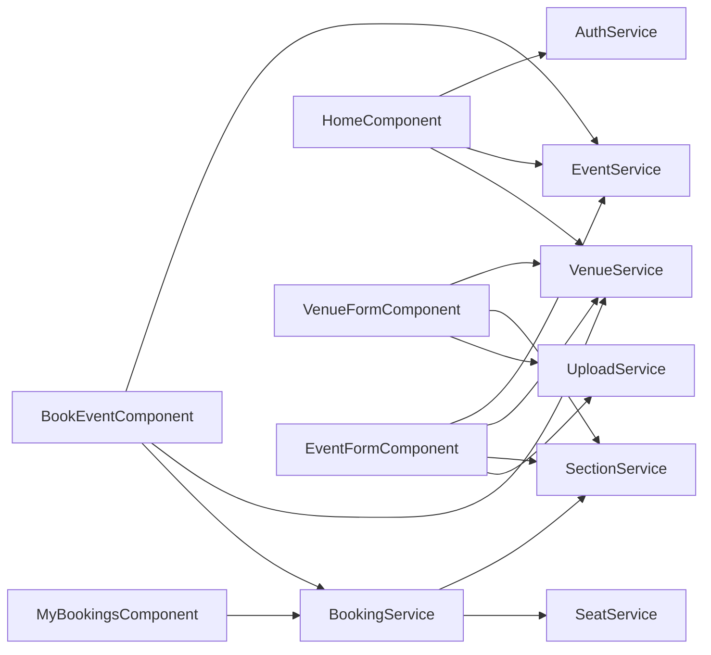
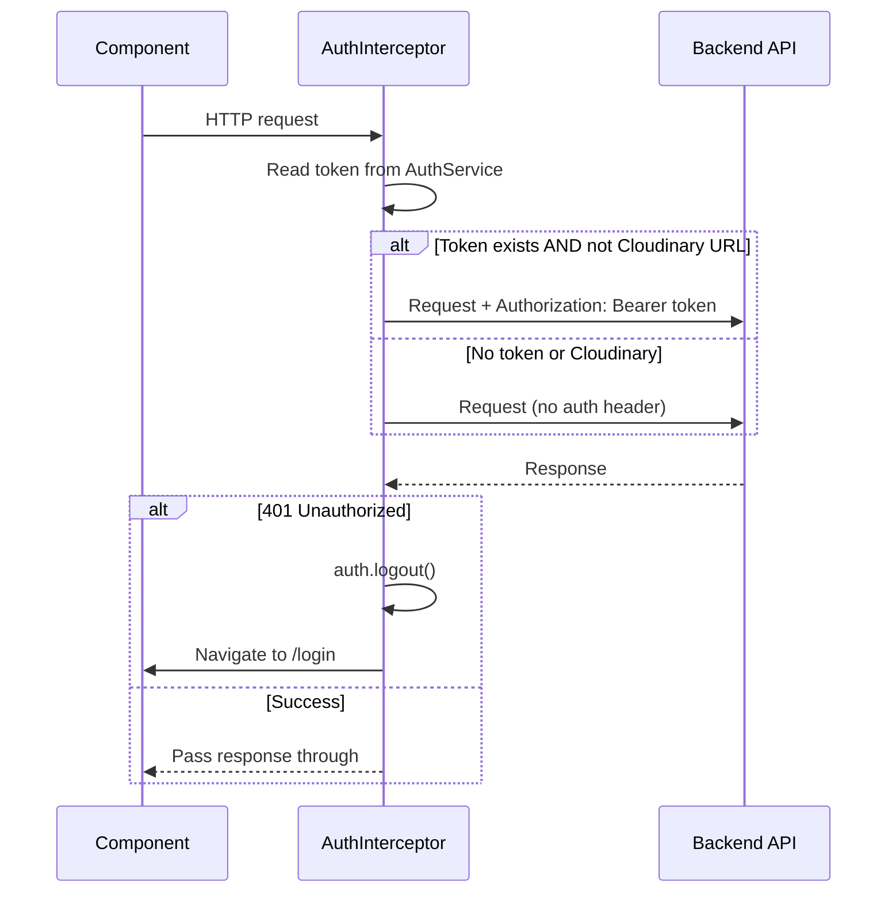
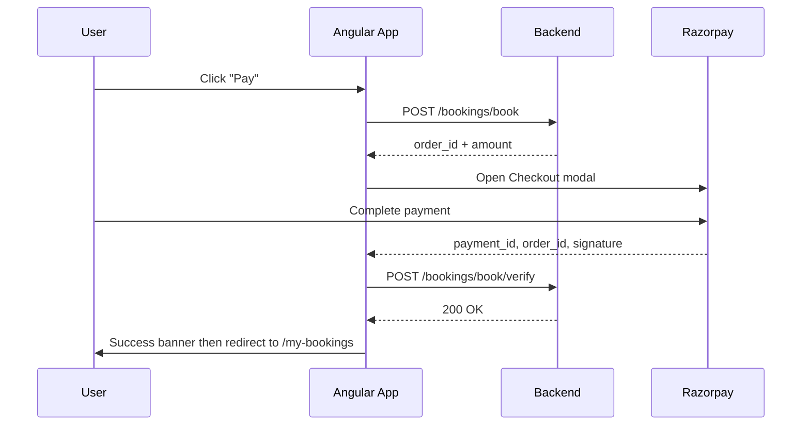
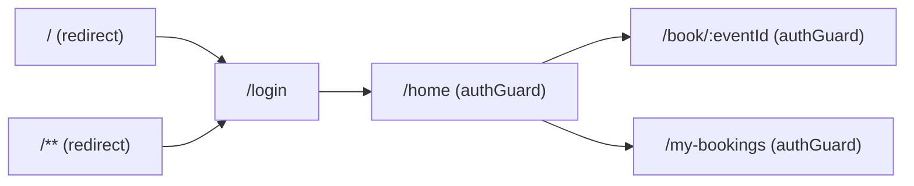

# EventMaster — Frontend

A full-featured event ticketing and management platform built with **Angular 22**, featuring real-time seat selection, integrated **Razorpay** payments, Cloudinary image uploads, and a responsive dark-themed UI.

---

## Table of Contents

- [Tech Stack](#tech-stack)
- [Project Structure](#project-structure)
- [Features](#features)
  - [Authentication](#1-authentication)
  - [Event Discovery (Home)](#2-event-discovery-home)
  - [Venue Management](#3-venue-management)
  - [Event Management](#4-event-management)
  - [Seat Booking & Payment](#5-seat-booking--payment)
  - [My Bookings](#6-my-bookings)
- [Application Flow](#application-flow)
- [Architecture Diagrams](#architecture-diagrams)
- [API Surface](#api-surface)
- [Environment Setup](#environment-setup)
- [Running Locally](#running-locally)
- [Building for Production](#building-for-production)

---

## Tech Stack

| Layer | Technology |
|---|---|
| Framework | Angular 22 (standalone components, signals) |
| Language | TypeScript 6 |
| Styling | SCSS with CSS custom properties |
| HTTP | Angular `HttpClient` with functional interceptors |
| Routing | Angular Router with lazy-loaded components |
| State | Angular Signals (`signal`, `computed`) |
| Payments | Razorpay Checkout.js |
| Image Uploads | Cloudinary (signed uploads via backend) |
| Testing | Vitest |
| Deployment | Vercel (`vercel-build` script) |

---

## Project Structure

```
src/
├── app/
│   ├── core/
│   │   ├── guards/
│   │   │   └── auth.guard.ts          # Route protection (JWT presence check)
│   │   ├── interceptors/
│   │   │   └── auth.interceptor.ts    # Attaches Bearer token; handles 401 auto-logout
│   │   └── services/
│   │       ├── auth.service.ts        # Login, register, JWT decode, logout
│   │       ├── event.service.ts       # Events CRUD + search/filter/pagination
│   │       ├── venue.service.ts       # Venues CRUD
│   │       ├── section.service.ts     # Sections (areas of a venue) CRUD + tier ordering
│   │       ├── seat.service.ts        # Seat layout fetching (legacy venue-scoped)
│   │       ├── booking.service.ts     # Booking APIs, seat availability, payment verify
│   │       └── upload.service.ts      # Cloudinary signed upload
│   ├── features/
│   │   ├── auth/
│   │   │   ├── login/                 # Login page
│   │   │   └── register/              # Registration page
│   │   ├── home/                      # Event listing, search, filters
│   │   ├── events/
│   │   │   ├── book-event/            # Interactive seat map + Razorpay checkout
│   │   │   └── event-form/            # Create / edit event modal with section pricing
│   │   ├── venues/
│   │   │   ├── venue-form/            # Create / edit venue with section management
│   │   │   └── seat-modal/            # Visual seat layout configuration per section
│   │   └── bookings/
│   │       └── my-bookings/           # User's booking history + seat detail modal
│   └── shared/
│       └── image-upload/              # Reusable Cloudinary image upload component
├── environments/
│   ├── environment.ts                 # Local config (git-ignored)
│   └── environment.example.ts        # Template to copy
└── styles.scss                        # Global design tokens & utilities
```

---

## Features

### 1. Authentication

- **Register** — create an account with a username, email, and password. On success the JWT is saved and the user is redirected to `/home`.
- **Login** — accepts either a username or email (`identifier` field) plus a password. JWT is stored in `localStorage` under the key `em_token`.
- **Auto-logout** — the HTTP interceptor watches every API response for a `401 Unauthorized` status, clears the token, and redirects to `/login`.
- **Route protection** — the `authGuard` blocks access to `/home`, `/book/:eventId`, and `/my-bookings` unless a valid token exists in `localStorage`.
- **JWT decoding** — `AuthService.currentUserId()` decodes the JWT payload client-side (no library) to retrieve the `sub` claim, enabling owner-only UI controls.

---

### 2. Event Discovery (Home)

The home page is the main dashboard once authenticated.

**Event Cards** — paginated grid of event cards (9 per page) each showing:
- Cover image (Cloudinary URL)
- Event name and description
- Venue name
- Date and time
- **Book Now** button (navigates to `/book/:eventId`)
- **Edit** button (only shown if `created_by === currentUserId`)

**Search & Filters** — all filters hit the API; results update in real time:

| Filter | Type | Behaviour |
|---|---|---|
| Name search | Text input | 400 ms debounce, distinct-until-changed |
| Venue | Dropdown | Instant filter |
| From date | Date picker | ISO date sent as query param |
| To date | Date picker | ISO date sent as query param |
| Clear Filters | Button | Resets all filters and reloads |

**Pagination** — smart page number bar that shows at most 7 page numbers with ellipsis collapses for large datasets. Previous/Next buttons included.

**Modals launched from Home:**
- Create Event form
- Edit Event form
- Manage Venues panel (toggled from the top navigation)

**Navigation bar** — contains links to My Bookings, Manage Venues toggle, and Logout.

---

### 3. Venue Management

Venues are the physical locations where events are held. Accessible from the Manage Venues panel on the home screen.

**Venue Form (Create / Edit):**
- Name and address fields
- Cover image upload via Cloudinary (drag-and-drop or file picker through the shared `ImageUploadComponent`)

**Section Management** (edit mode only):
- Lists all sections (seating areas of the venue)
- **Add Section** — inline input row to create a new named section
- **Rename Section** — click the pencil icon for inline rename
- **Drag-and-drop tier ordering** — sections can be reordered by dragging; their `tier` values (1 = most premium) are persisted to the backend on drop
- **Configure Seats** — opens the `SeatModalComponent` to visually define the seat layout (rows × seats) for any section

**Seat Modal:**
- Displays the full row/seat grid for a section
- Allows the admin to view and configure seat arrangements per section

---

### 4. Event Management

Events are created on top of a venue and carry per-section pricing.

**Event Form (Create mode):**
1. Fill in: name, description, event date & time, venue (dropdown)
2. On venue selection the form fetches all sections belonging to that venue
3. A price input appears for every section — all must have a price > 0 to submit
4. On submit: `POST /events/add` with the event data and section pricing array
5. Cover image upload via Cloudinary

**Event Form (Edit mode):**
- Pre-populates all fields from the existing event
- Only event metadata (name, description, date, image) can be edited — section prices are not re-editable after creation

---

### 5. Seat Booking & Payment

Route: `/book/:eventId`
Protected by `authGuard`.

**Data loading:**
- Fetches event details, all venues, and all sections with live seat availability in parallel using `forkJoin`
- Seat statuses: `AVAILABLE` | `BOOKED` | `HELD`

**Header:**
- Event name, venue name, date/time, and description
- **Price legend** — colour-coded dot per section tier with name, price, and seat count

**Section Tabs:**
- One tab per section, colour-coded by tier
- Switching sections clears current seat selection

**Seat Map:**
- Theatre-style screen/stage bar at the top
- Rows and seats rendered from the API response
- Seats are centred per row using ghost padding cells
- Seat states:
  - **Available** — clickable, highlights on hover with section colour
  - **Selected** — filled with section colour + glow shadow
  - **Booked** — greyed out, strikethrough seat code, not clickable
  - **Held** — amber tint, not clickable (temporarily reserved by another user)
- Empty rows (no seats) rendered as a faded "empty row" bar

**Sidebar — Selected Seats:**
- Lists each selected seat with section name, row, code, and price
- Individual remove buttons
- Running total (formatted as Indian Rupees)
- **Pay button** — triggers the booking flow

**Booking & Payment Flow:**
1. `POST /bookings/book` → backend creates a Razorpay order and returns `{ order_id, amount }`
2. Razorpay Checkout modal opens in the browser (loaded from Razorpay CDN in `index.html`)
3. On payment success → `POST /bookings/book/verify` with `{ payment_id, order_id, signature }`
4. On verification success → success banner shown → redirect to `/my-bookings` after 2 s
5. On payment failure or dismissal → redirect to `/home`

---

### 6. My Bookings

Route: `/my-bookings`
Protected by `authGuard`.

- Lists all past bookings for the logged-in user, sorted newest-first
- Each booking card shows: event image, event name, venue, date, booking date, total amount, and a **status badge** (CONFIRMED / PENDING / CANCELLED)
- **View Details** button opens a modal:
  - Full booking metadata
  - Seat breakdown grouped by section (section name → row + seat code + price per seat)

---

## Application Flow

```mermaid
flowchart TD
    A([Browser]) --> B{Token in localStorage?}
    B -- No --> C[/login]
    B -- Yes --> D[/home]

    C --> E[Register / Login]
    E -->|JWT saved| D

    D --> F{User action}

    F -->|Search / filter| D
    F -->|Create Venue| G[Venue Form Modal]
    F -->|Edit Venue| G
    G -->|Section drag-drop / seat config| G
    G -->|Save| D

    F -->|Create Event| H[Event Form Modal]
    F -->|Edit Event| H
    H -->|Upload image| I[Cloudinary]
    I -->|secure_url| H
    H -->|Save| D

    F -->|Book Now| J["/book/:eventId"]
    J --> K[Select Seats]
    K --> L[Pay Button]
    L --> M[POST /bookings/book]
    M -->|order_id + amount| N[Razorpay Checkout]
    N -->|Payment success| O[POST /bookings/book/verify]
    O -->|Verified| P[/my-bookings]
    N -->|Failed / Dismissed| D

    F -->|My Bookings| P
    P --> Q[View Detail Modal]
```

---

## Architecture Diagrams

### Component Tree



---

### Service Dependency Graph



---

### HTTP Interceptor Flow



---

### Seat Booking & Payment Sequence



---

### Routing Map



---

## API Surface

All requests are prefixed with `environment.apiBaseUrl`.

| Method | Endpoint | Description |
|---|---|---|
| `POST` | `/users/register` | Create a new account |
| `POST` | `/users/login` | Authenticate and receive JWT |
| `GET` | `/events` | List events (name, venue, date filters + pagination) |
| `GET` | `/events/:id` | Get single event by ID |
| `POST` | `/events/add` | Create an event with section pricing |
| `PATCH` | `/events/update/:id` | Update event metadata |
| `GET` | `/venues` | List all venues |
| `POST` | `/venues/add` | Create a venue |
| `PATCH` | `/venues/update/:id` | Update venue |
| `GET` | `/venues/:venueId` | Get sections for a venue |
| `POST` | `/venues/:venueId/add-section` | Add a section to a venue |
| `POST` | `/venues/:venueId/:sectionId/update-section` | Rename a section |
| `PATCH` | `/venues/:venueId/update-tier` | Persist drag-and-drop section order |
| `GET` | `/bookings/:eventId/sections/` | Get sections with pricing for booking |
| `GET` | `/bookings/:eventId/sections/:sectionId/seats` | Get live seat availability |
| `POST` | `/bookings/book` | Reserve seats and create Razorpay order |
| `POST` | `/bookings/book/verify` | Verify Razorpay payment signature |
| `GET` | `/bookings` | List the current user's bookings |
| `GET` | `/bookings/:bookingId` | Get seat details for a booking |
| `GET` | `/global/upload-signature` | Get Cloudinary signed upload credentials |

---

## Environment Setup

Copy the example environment file and fill in your values:

```bash
cp src/environments/environment.example.ts src/environments/environment.ts
```

```typescript
// src/environments/environment.ts
export const environment = {
  production: false,
  apiBaseUrl: 'http://localhost:8000',   // your backend URL
  razorpayKeyId: 'rzp_test_XXXXXXXXXX', // your Razorpay test key
};
```

> **Never commit `environment.ts`** — it is listed in `.gitignore`. For Vercel deployments, the `generate-env.mjs` script reads environment variables and generates the file at build time.

---

## Running Locally

```bash
# Install dependencies
npm install

# Start the dev server
npm start
# or
ng serve
```

Open `http://localhost:4200/` in your browser. The app reloads automatically on file changes.

---

## Building for Production

```bash
npm run build
```

Build artifacts are written to `dist/`. For Vercel the `vercel-build` script runs `generate-env.mjs` first to inject runtime environment variables before calling `ng build`.

---

## Running Tests

```bash
npm test
# or
ng test
```

Tests are run with **Vitest**.
